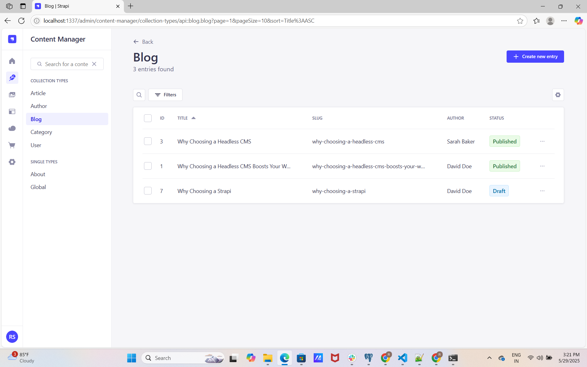
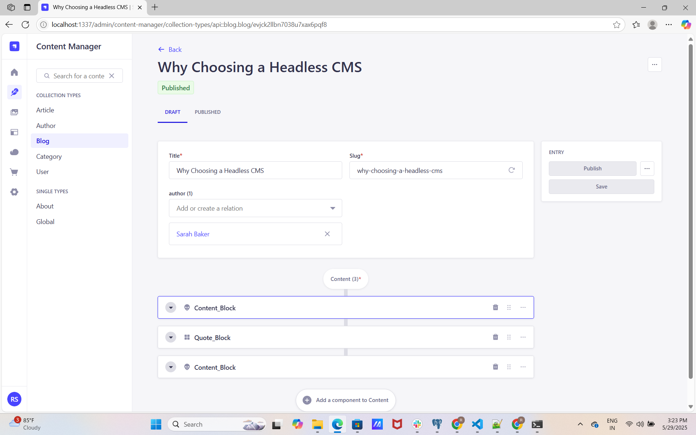
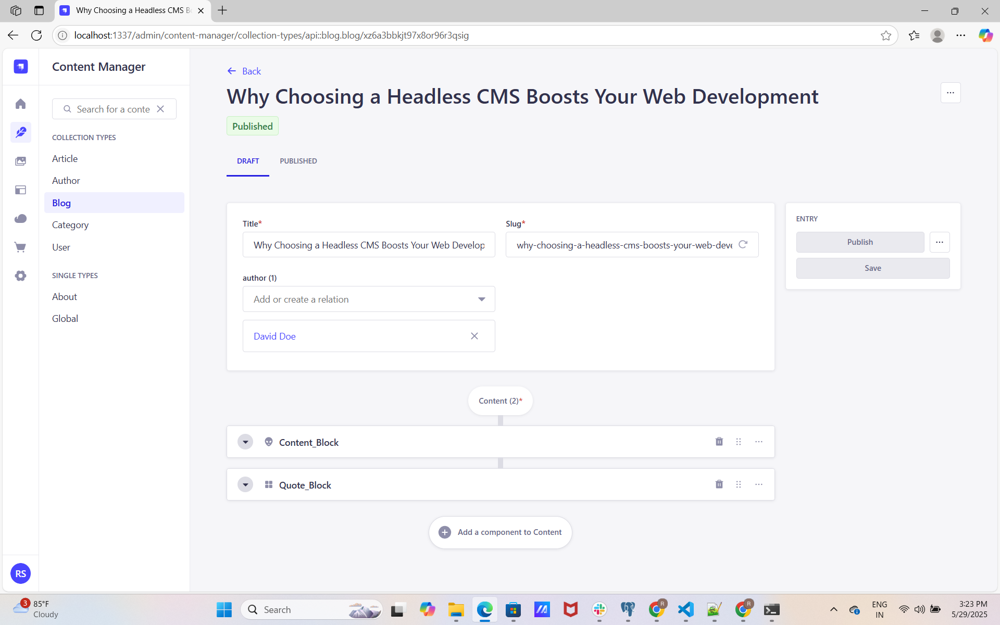
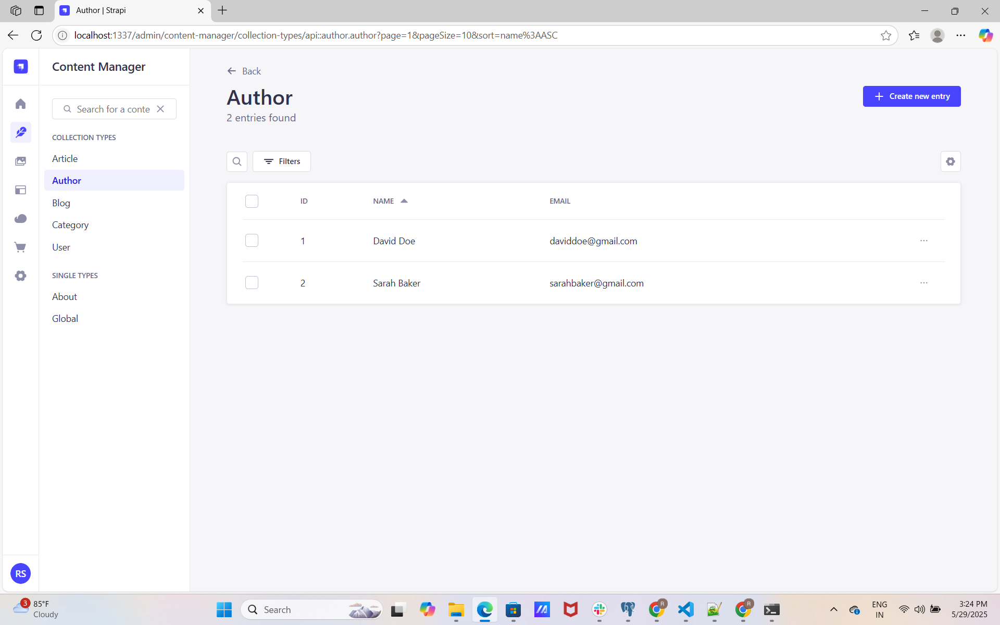
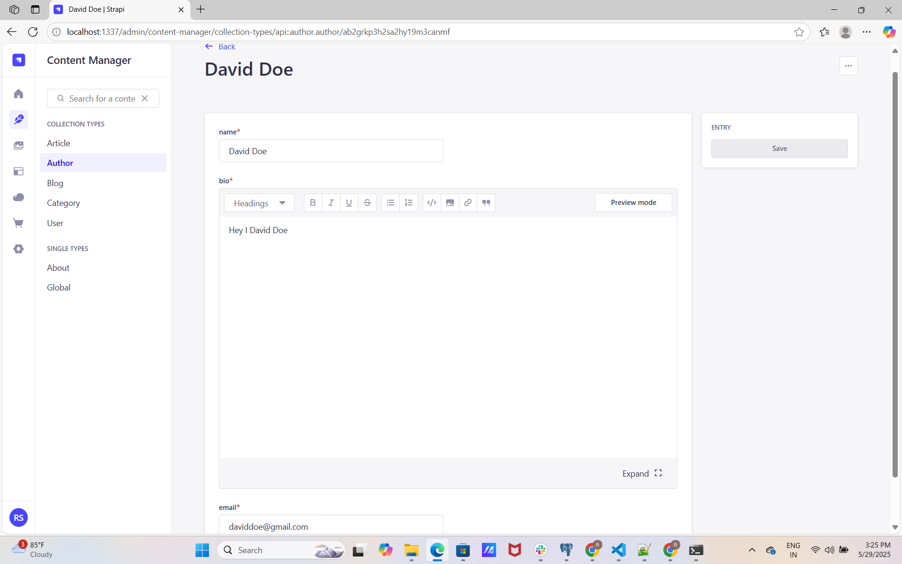

### `develop`

Start your Strapi application.

```
cd Blog_App_Strapi

npm i

npm run develop
# or
yarn develop
```

### `start`

Start your Strapi application with autoReload disabled. [Learn more](https://docs.strapi.io/dev-docs/cli#strapi-start)

```
npm run start
# or
yarn start
```

### `build`

Build your admin panel. [Learn more](https://docs.strapi.io/dev-docs/cli#strapi-build)

```
npm run build
# or
yarn build
```

## 📚 view








